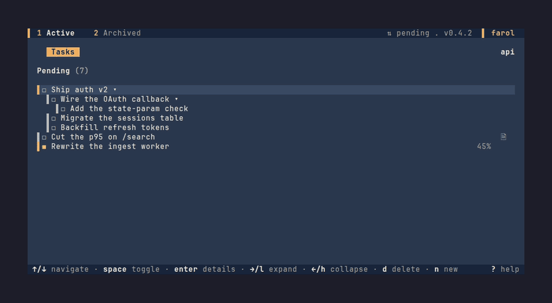
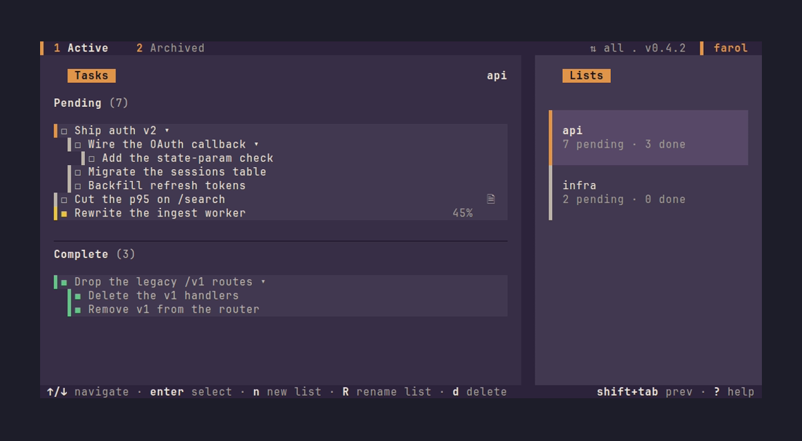
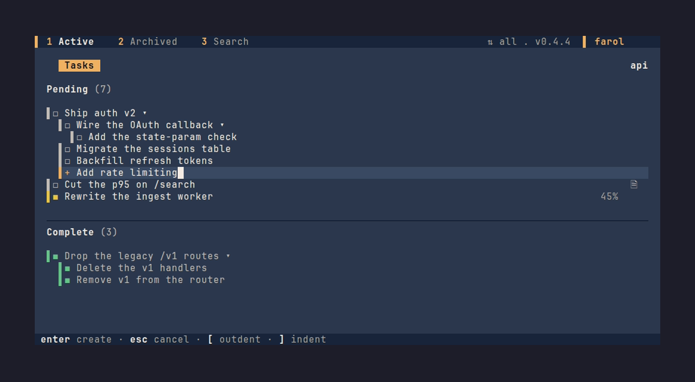
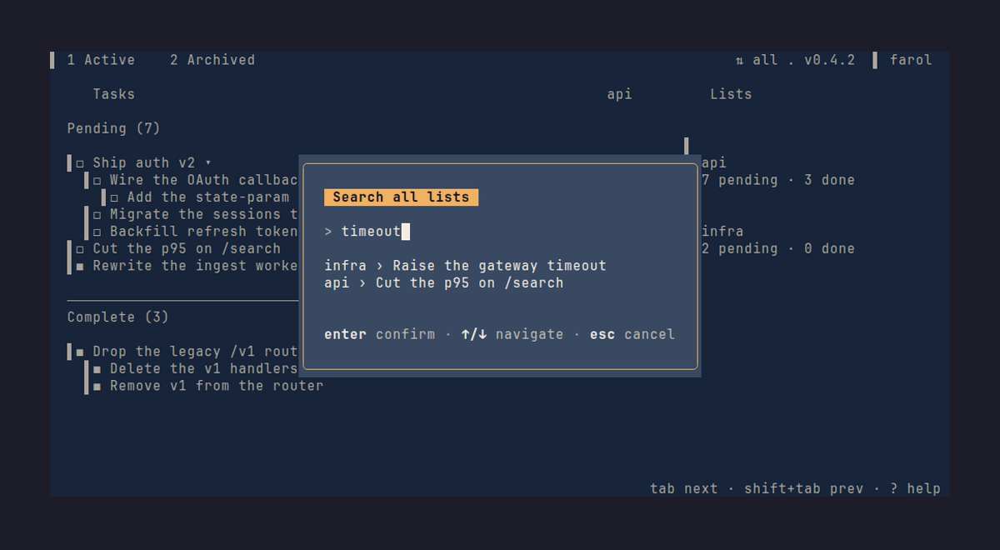
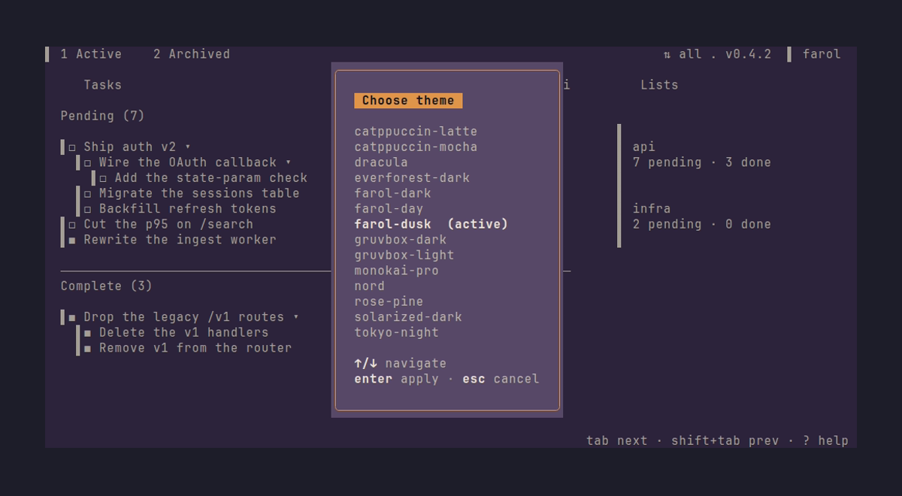
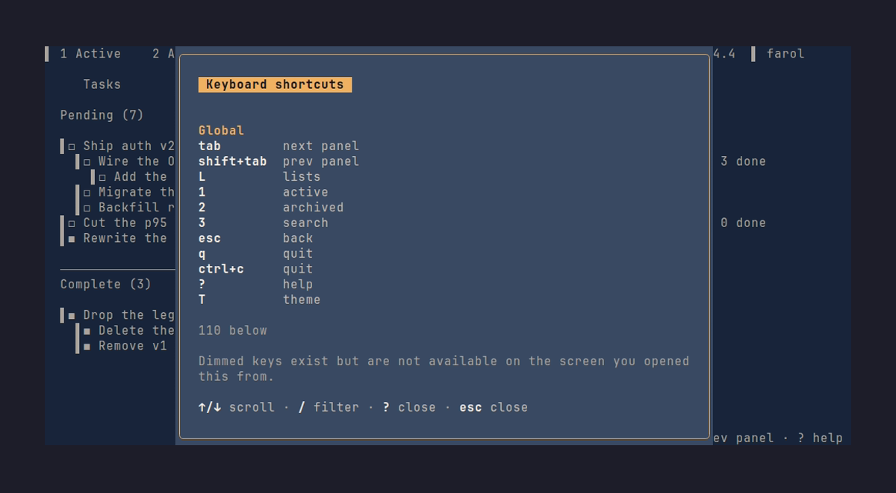
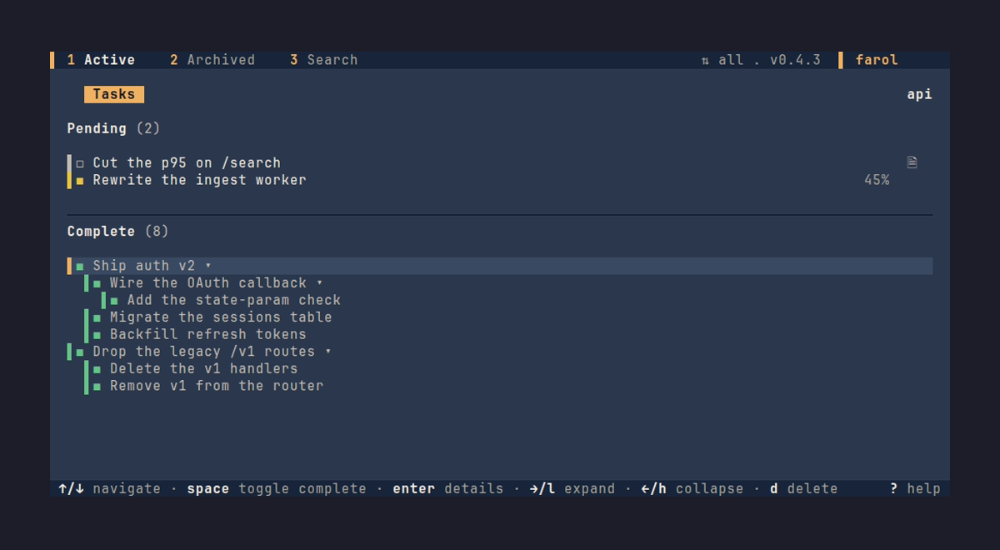
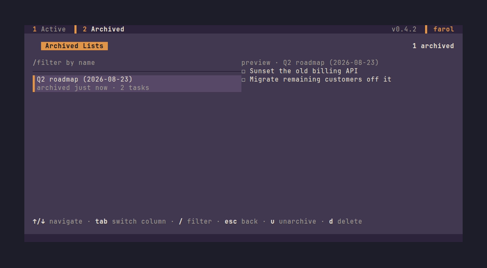

# Farol

**A terminal to-do list you can watch, and your agent can steer.**


<p align="center"></p>

[**Demo**](#demo) • [**Features**](#features) • [**Get Started**](#get-started) • [**Usage**](#usage) • [**For Agents**](#for-coding-agents)

---

## Demo



---

## Origin story

This project started from a real workflow problem. When I work with AI coding agents, I found myself jumping between windows constantly. Open a todo app. Add a task when an idea pops into my head. Wait for the agent to finish what it was doing. Check the todo app. Talk to the agent about the next thing. Then manually check that task off my list. As more tasks piled up, that loop got messy fast.

There has to be a better way to do this (I'm absolutely certain there is). Well, anyways... building this has been fun, and I learned a lot about Go along the way. I plan to keep adding features / squashing bugs because this is something genuinely helpful to me. These are the things I think Farol actually brings to the table, beyond being a fast terminal todo list:

---

## Features

- **Watch an agent work.** Leave the TUI open in a pane while
  Claude Code, Pi, or a shell script adds, completes, and updates tasks.
  Watch it happen live. When an agent claims a task, you see **which** row, 
  not just that something changed.

- **A UI that serves both humans and agents.** No agent-specific plumbing
  bolted onto a human app, or a human UI bolted onto an agent tool. The TUI
  and the CLI are two views of **one store**. Any state change one makes, the
  other sees within a second.

- **Tree-structured with derived progress.** Nest tasks to any depth and watch
  percentages compute automatically.

### Everything it does

| Feature | Description |
|---------|-------------|
| **Two-pane layout** | Tasks on the left, lists on the right (toggles with `L`) |
| **Vim + arrow keys** | navigate, `space` toggle, `/` fuzzy search, `F` global search |
| **Nested tasks** | `]` to add a child, `[` to add a sibling of parent |
| **Status model** | `pending`, `in_progress`, `complete` with user % or derived % |
| **Live agent presence** | Animated spinner lights on task writes. You see exactly what's working. |
| **4-value priority** | `high` > `medium` > `low` > `none` (drives `farol next` ordering) |
| **Agent CLI** | a single agent-facing front end: every operation is a `farol` subcommand emitting one JSON value with `--json` |
| **Notes, comments, attachments** | Long-form notes per task, threaded comments, and file attachments (path, stdin, or URL) added via `farol attach`; view and delete them in the details modal |
| **Change feed** | `farol diff <list-id> --since <unix-seconds>` returns tasks added or changed since a timestamp — cheap to poll; `farol watch <id>` streams the same changes live until `Ctrl+C` |
| **Export / Import** | `farol export` / `farol import` (or `e` / `i` in the Lists panel) move lists and tasks between stores as versioned JSON |
| **Archiving** | `farol lists archive`/`unarchive` hides a finished list from the sidebar and agent discovery without deleting it; browse, unarchive, or permanently delete archived lists from the TUI's Archived Lists page (`2`) |
| **Themes** | 14 themes: three of the app's own (`farol-dark`, `farol-dusk`, `farol-day`) plus eleven imported community palettes (see `docs/DESIGN.md` §11) |

---

## Screenshots

| Main view | Add task | Search |
|-----------|----------|--------|
||||
|Tasks (left) + lists (right)|Inline add with level indicator|Global search picker|

| Theme picker | Help | Complete section |
|--------------|------|------------------|
||||
|Live theme preview|Full keybinding catalog|Tasks cascade to Complete on `space`|

| Archived Lists |
|-----------------|
||
|Browse, unarchive, or permanently delete (`2`)|

---

## Get started

### Installation

```bash
# Using Go
go install github.com/filipemolina/farol@latest

# Or build from source
git clone https://github.com/filipemolina/farol.git
cd farol
make build  # installs to ~/go/bin/farol

# Or download a pre-built binary
# See https://github.com/filipemolina/farol/releases
```

### Launch

```bash
farol              # opens the TUI
farol --help       # shows all CLI commands
```

### First run

On first launch, Farol creates:
- Data: `~/.local/share/farol/farol.db` (SQLite store)
- Config: `~/.config/farol/config.yaml` (theme, layout)

The default list `Inbox` is created automatically; the app opens on the
`farol-dusk` theme (switchable with `T`).

---

## Usage

### The TUI

| Keystroke | Action |
|-----------|--------|
| `↑` / `↓` | Navigate tasks |
| `←` / `→` | Collapse or expand the task tree |
| `tab` / `shift+tab` | Cycle panels (tasks and lists). Locked while typing a new task: focus stays on the text input |
| `space` | Toggle task complete (cascades to descendants) |
| `enter` | Show task details |
| `esc` | Close details, picker, or cancel |
| `n` | Start adding a new task (inline) |
| `d` | Delete the selected task |
| `]` | Indent the selected task (re-parent under previous sibling) |
| `[` | Outdent the selected task (promote out of its parent) |
| `alt+↑` / `alt+↓` | Move the selected task up or down among its siblings |
| `g` / `G` | Jump to the first or last row |
| `pgup` / `pgdown` | Page through the tree |
| `u` | Release your assignment on the selected task |
| `U` | Release every assignment you hold on the current list |
| `ctrl+y` | Copy the selected task's id |
| `s` | Sort the current list |
| `v` | Cycle the task tree's view: both sections, Pending only, Complete only |
| `/` | Filter current list (fuzzy search) |
| `F` | Global search across all lists |
| `e` | Export the store or highlighted list to JSON |
| `i` | Import lists from a JSON file |
| `T` | Toggle theme picker |
| `L` | Toggle lists panel visibility |
| `1` | Switch to the Active page (tasks and lists) |
| `2` | Switch to the Archived Lists page (`u` unarchives, `d` permanently deletes, `esc` or `1` to leave) |
| `a` | Open the About modal |
| `?` | Show help overlay |
| `q` / `Ctrl+C` | Quit |

In the **lists** panel (`tab` to focus it), `n` creates a list, `R` renames
the highlighted one, `A` archives it, `d` deletes it, and `e` / `i` export and
import. The list editor's `space` toggles a list **collaborative** — see
[For coding agents](#for-coding-agents) for what that opens up.

The details modal (`enter` on a task) has one more tab-cycled zone beyond
Title/Notes/Progress/Priority/Comments: **Attachments**, listing the task's
files. `↑`/`↓` (or `k`/`j`) move the highlight and `d` deletes the selected
one (confirm-guarded). There is no key to *add* an attachment — that's
CLI-only, via `farol attach` (see below).

### The CLI

Every TUI operation is available via CLI commands (`farol --help` lists them all):

```bash
# Lists
farol lists                       # list all lists with counts (--include-archived, --mine, --foreign)
farol lists add "Home"            # create a list (human-managed: only you restructure it)
farol lists add "Home" --owner pi # create a list owned by an agent tag
farol lists rename <id> "Garden"  # rename a list
farol lists rm <id> --force       # delete a list and its tasks (--force required)
farol lists archive <id>          # archive a list (hides it from the sidebar and discovery)
farol lists unarchive <id>        # restore an archived list

# Tasks
farol tasks <list-id>             # show tasks in a list (tree view; --flat, --status, --since, --include)
farol add <list-id> "Buy paint"   # add a root task
farol add <list-id> "Mix colors" --parent <task-id>  # add a subtask
farol show <task-id> --json       # show full task details
farol <task-id>                   # mark task complete (cascades)
farol complete <task-id> [<task-id> ...]  # mark one or more tasks complete (cascades)
farol toggle <task-id>            # complete <-> reopen, whichever applies
farol reopen <task-id> [<task-id> ...]    # reopen one or more complete tasks
farol rename <task-id> "New name" # rename a task
farol notes <task-id> "text..."   # replace a task's notes (whole text)
farol mv <task-id> --parent <id>  # re-parent a task (or --root)
farol rm <task-id> --force        # delete a task and descendants (--force required)
farol diff <list-id> --since <unix-seconds>   # tasks added or changed since a timestamp
farol watch <list-id|task-id>     # stream every change as it happens, until Ctrl+C

# Progress & priority
farol progress <task-id> --mode percentage --percent 60
farol progress <task-id> --mode subtasks   # derive % from children
farol progress <task-id> --mode simple     # plain in_progress flag
farol priority <task-id> high    # none | low | medium | high

# Comments
farol comment <task-id> "note"    # add a comment to a task; prints its id
farol comment rm <comment-id> --force   # delete a comment (--force required)

# Attachments (CLI-only — adding a file has no TUI keybinding)
farol attach <task-id> <path>     # attach a local file, stored by path (not copied)
farol attach <task-id>            # attach from stdin, e.g. `cat file | farol attach <task-id>`
farol attach <task-id> <url>      # attach an http(s) URL; it's downloaded and stored
farol attachments <task-id>       # list a task's attachments
farol detach <attachment-id>      # remove an attachment

# Assignment & presence
farol next <list-id>              # grab the top eligible task (auto-claims it)
farol assign <task-id>            # assign to current agent; --force takes it
farol unassign <task-id>          # release the current agent's assignment
farol unassign --list <list-id>   # release every task you hold on that list
farol claim <task-id|list-id>     # explicit presence claim (--kind working|inspecting)
farol release <task-id|list-id>   # release presence; --all clears every claim
farol work                        # list every live presence claim

# Agent onboarding
farol inbox                       # your list + every other list, with top pending tasks
farol agent help                  # print the agent interaction protocol (markdown)
farol skill                       # print the full agent command reference (markdown)

# Search
farol search "paint"              # fuzzy search across titles and notes
farol search "deck" --json        # JSON output (--list <id> restricts to one list)

# Export & import
farol export [list-id] [--out <file>]  # export the whole store or one list
farol import <file> [--list <id>]      # import lists and tasks from an export file

# Store & config
farol status                      # counts, store size, migration level, config path
farol config                      # view and edit ~/.config/farol/config.yaml
farol work clean                  # drop presence claims older than the 120s TTL

# Global
farol --help                      # full CLI reference
farol --version                   # version
```

---

## For coding agents

Farol isn't a todo list with a CLI bolted on. The CLI *is* the agent's API, the
TUI is the human's dashboard, and both read and write **one SQLite store** — a
change on either side shows up on the other within a second. No sync, no polling
loops, no daemon, no "did it save?" uncertainty.

Agent identity comes from the `FAROL_AGENT` environment variable. **Set it.**
Unset, the CLI falls back to the shared tag `agent`, so every unconfigured agent
acts as the same one and they overwrite each other with no refusal. With it set,
the agent shows up as a live spinner on its task row in the TUI, so the human
sees *which* task is being worked, not just that something changed.

### The working loop

```bash
# Teach it: emit the full agent reference and drop it into the agent's context
farol skill > .agent/skills/farol.md

# The whole loop — plain shell calls:
export FAROL_AGENT=claude
farol inbox --json                       # start-of-session context
farol next <list-id> --json              # grab the top eligible task (auto-claims it)
farol progress <task-id> --mode percentage --percent 50
farol comment <task-id> "tests green"
farol <task-id>                          # mark complete when done
farol release --all                      # drop every presence claim
```

`farol skill` is the canonical onboarding: it prints the identity contract, the
working loop, the presence-versus-assignment distinction, the ownership gate,
and the traps an agent hits on its first run. Pipe it into an agent's context
and it knows the whole API. `farol agent help` is the short form — the working
loop alone, without the full command reference.

### The JSON contract

| Guarantee | What it means |
|-----------|---------------|
| **One value per call** | Every subcommand takes `--json` and emits exactly one JSON value on stdout, success or error. No mixed stdout/stderr, no text to parse. (`farol watch` is the deliberate exception: it streams one JSON value per line.) |
| **Predictable failures** | Errors are `{"error": "..."}` with consistent exit codes: `0` success, `1` domain error, `2` usage. |
| **ID prefixes everywhere** | Every `<task-id>` and `<list-id>` argument accepts an unambiguous ULID prefix — copy 8 characters out of `farol tasks --json` and it just works. |
| **No server process** | The CLI talks straight to SQLite. One binary, no socket, nothing to keep running. |
| **Deletes need `--force`** | `rm`, `lists rm`, and `comment rm` refuse to run without it — there is no confirm prompt to answer from a script. |

### How two agents share a list

| Mechanism | What it does |
|-----------|--------------|
| **`farol next` is the queue** | Returns the highest-priority eligible task (priority, then tree order), auto-claims it, prints its JSON. `farol release <id>` or `farol unassign <id>` hands it back. No manual queue management. |
| **Assignment reserves the subtree** | Claiming a task locks its whole subtree: no other agent can take an ancestor or a descendant of it. That's how two agents on one list never do the same work twice. |
| **Ownership gates structural writes** | `add`, `mv`, `rm`, `rename`, `notes`, and `priority` refuse to run on a list this agent does not own; status, progress, and comments stay open to everyone. Agents cooperate on work without reshaping each other's boards. |
| **Ownership is opt-in** | A list is writable when its `created_by` matches `FAROL_AGENT`, or when it is flagged **collaborative** (`space` in the TUI's list editor), which opens it to everyone. A list created with no owner is human-managed and foreign to *every* agent — give an agent its own board with `farol lists add "Work" --owner <tag>`. |
| **Presence is public** | `farol work --json` lists every live claim in the store; the TUI renders each one as a spinner tagged with the agent's name. |

### Context and handoffs

- **`farol inbox`** — the start-of-session call. One read returns the agent's own
  list plus every other list in the store, with pending and complete counts and
  the top pending tasks in each. The whole board in a single JSON value.
- **`farol diff <list-id> --since <unix-seconds>`** — every task added or changed
  since a timestamp. Cheap to call, easy to loop on. `farol watch <id>` is the
  live version: it long-polls and prints one line per change until `Ctrl+C`,
  and `--since` replays the same window first.
- **`farol export --json` / `farol import`** — dump the entire store (or one list)
  as versioned JSON and restore it. Checkpoint an agent session, or move work
  between machines.

> **On MCP:** Farol shipped an MCP server and retired it in the CLI-first
> migration. A subprocess and a JSON-RPC handshake to run commands the agent
> could already run is a moving part with nothing to show for it.

---

## Project status

Alpha shipped. Phases 0–9 of [`docs/ROADMAP.md`](docs/ROADMAP.md) are
complete (tagged `v0.1.0`). Post-alpha work is at `v0.4.1`.

See [`docs/STATUS.md`](docs/STATUS.md) for what each phase changed and why.

---

## Built with

- [Go](https://go.dev)
- [Bubble Tea](https://github.com/charmbracelet/bubbletea) /
  [Lip Gloss](https://github.com/charmbracelet/lipgloss)
- [Cobra](https://github.com/spf13/cobra)
- [modernc.org/sqlite](https://gitlab.com/cznic/sqlite): pure Go, no CGO

See [`docs/DESIGN.md`](docs/DESIGN.md) for the architectural rationale.

---

## Contributing

Read [`CONTRIBUTING.md`](CONTRIBUTING.md) before writing code. It is
stricter than typical because this project expects unsupervised agents to
work from the docs alone. No back-and-forth review needed.

If you are an AI coding agent, read [`AGENTS.md`](AGENTS.md) instead: it has
the operational rules, the known hallucination traps in this stack, and the
verification habits the project expects.

---

## License

[MIT](LICENSE). © 2026 Filipe Molina.

---

**Questions?** Open an issue with "[Question]" in the title, or ask in a
discussion.
