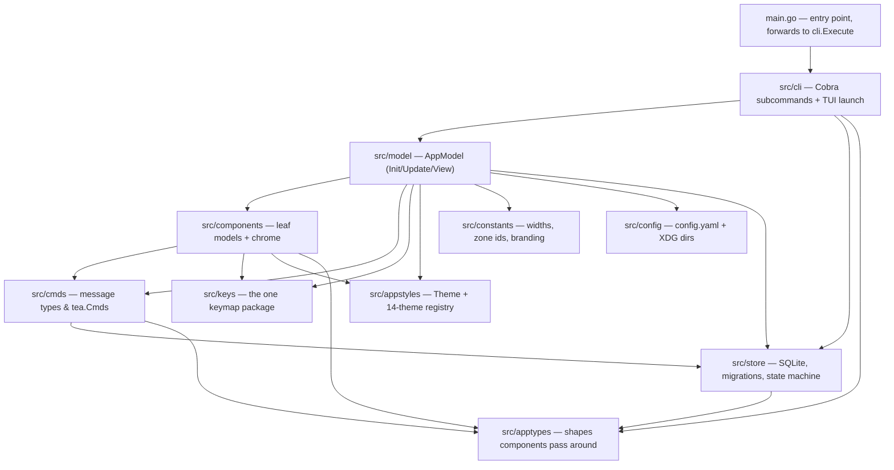

Farol is a keyboard-first task manager for humans and AI agents: a terminal UI for the person at the keyboard, a CLI that is the single agent-facing front end, and one SQLite store that both of them talk to. This guide is the on-ramp for contributors — human or agent — who are about to write code in this repository.

Everything here is grounded in the repository itself. The authoritative specification is [`docs/DESIGN.md`](https://github.com/filipemolina/farol/blob/main/docs/DESIGN.md) in the repo root; every page in this guide cites it and the source under `src/`. If a claim here disagrees with the code, the code is the bug — and if a claim disagrees with `docs/DESIGN.md`, `docs/DESIGN.md` wins.

## The stack

Farol is deliberately small. The entire dependency list, from `go.mod`:

| Package | Version | Role |
| --- | --- | --- |
| `charm.land/bubbletea/v2` | v2.0.7 | The TUI framework: the Elm-style message loop every screen runs on |
| `charm.land/lipgloss/v2` | v2.0.2 | Styling: colors, padding, layout composition, the layer compositor modals use |
| `charm.land/bubbles/v2` | v2.1.0 | Stock widgets: `list`, `textinput`, `textarea`, `spinner`, `key` |
| `github.com/spf13/cobra` | v1.10.2 | The CLI: every subcommand, `--help`, flag parsing |
| `modernc.org/sqlite` | v1.55.0 | The database driver — pure Go, no CGO |
| `gopkg.in/yaml.v3` | v3.0.1 | The config file (`~/.config/farol/config.yaml`) |
| `github.com/sahilm/fuzzy` | v0.1.3 | The `/` filter and the cross-list Search page |
| `github.com/charmbracelet/x/ansi` | v0.11.7 | ANSI-aware width measurement and truncation |

Two things to know before touching the TUI half:

- **Bubble Tea v2 / Lip Gloss v2 / Bubbles v2 are a breaking rewrite of the v1 APIs** that dominate public examples. `tea.Model.View()` returns a `tea.View` struct, not a `string`; `tea.KeyMsg` is `tea.KeyPressMsg`; `lipgloss.Color()` returns an `image/color.Color`; exported `Width`/`Height` fields became getter/setter methods. Each package ships its own upgrade guide in the module cache — read it before writing the first line against any of the three.
- **The SQLite driver registers as `"sqlite"`, not `"sqlite3"`.** `sql.Open("sqlite3", …)` fails at runtime with "unknown driver" and survives `go build`. The `store` package is the only place this matters — see [Storage and concurrency](/contributors/storage/).

## The two-half architecture

The package layout is a deliberate split, stated in `docs/DESIGN.md` §10:

- **The Bubble Tea half** — `src/model`, `src/components`, `src/cmds`, `src/keys`, `src/appstyles`, `src/constants`. Everything that renders a screen or reacts to a keystroke.
- **The non-Bubble-Tea half** — `src/store`, `src/apptypes`, `src/config`. Everything that touches data, shapes, or user preferences, with no terminal in sight.
- **`src/cli`** — the agent-facing front end, one file per subcommand group, a thin adapter from Cobra flags to a `store` call.

The two halves meet at one boundary: `src/store` is the **only** package that imports `database/sql` or `modernc.org/sqlite`. Neither the TUI (`src/model`) nor the CLI (`src/cli`) ever builds a SQL string; both call `store` functions and render the results. `src/apptypes` is the shape language that crosses the boundary — the store's row types converted into what components pass around.

The two front ends are **siblings over the same store, not layered on each other** — the structural expression of "neither front end is secondary" (`docs/DESIGN.md` §1). A write from either is visible to the other within one poll tick.

## The two documents that matter

Before writing any code, read these in order:

1. **[`docs/DESIGN.md`](https://github.com/filipemolina/farol/blob/main/docs/DESIGN.md)** — the specification. The data model, the status/progress state machine, the level rules for adding a task, the focus and keybinding contract, theming, storage, and the full CLI spec. This is not background reading; it is the contract. If your change contradicts something in here, either the change is wrong or the document needs to be updated *first*, as its own commit, with the reasoning written into it.
2. **[`docs/ROADMAP.md`](https://github.com/filipemolina/farol/blob/main/docs/ROADMAP.md)** — what has shipped and what it found, what is still ahead, and the decisions already taken that a change should not re-litigate.

`CONTRIBUTING.md` (for humans) and `AGENTS.md` (for AI agents) carry the operational rules: the build/test loop, the glossary of fixed vocabulary, and the known hallucination traps in this stack.

## How to navigate this guide

| Page | What it covers |
| --- | --- |
| [Architecture](/contributors/architecture/) | How the layers fit together: the two halves, the request/response split, the poll loop, concurrency |
| [Project structure](/contributors/project-structure/) | The `src/` tree, per-package responsibilities, and the two single-source-of-truth seams |
| [Core concepts](/contributors/core-concepts/) | The mental model: the Tea loop, focus, the esc ladder, the status/progress state machine |
| [The keybinding system](/contributors/keybinding-system/) | Every key declared once in `src/keys`; the footer and help overlay render from it |
| [The theme system](/contributors/theme-system/) | How the 14 themes are derived from a handful of base colors |
| [Storage and concurrency](/contributors/storage/) | The SQLite store, migrations, ULIDs, and the one-resolution rule |
| [Testing](/contributors/testing/) | How to test a TUI: three tiers, table-driven state-machine tests, VHS |
| [Development workflow](/contributors/development-workflow/) | The build/test loop, CI, code style, and releases |
| [Contributing](/contributors/contributing/) | How to find work, commit, and open a PR; the glossary and the chrome-package contract |