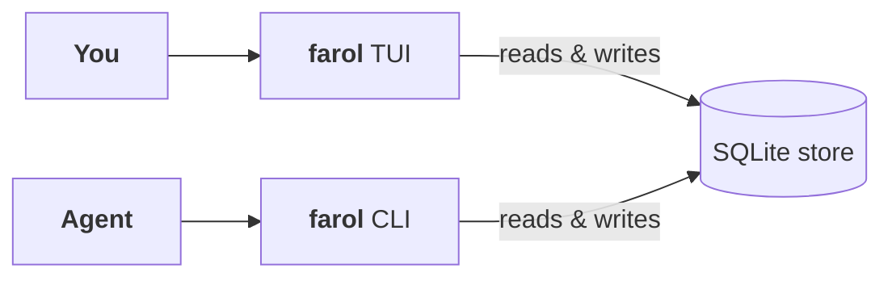

import { Aside, Card, LinkCard } from '@astrojs/starlight/components';

farol is a terminal to-do list built for working alongside coding agents. It is a TUI for the person at the keyboard and a CLI that is the single agent-facing front end. Both talk to the same SQLite file, so a task an agent claims from its shell lights up on your row within a second, and a task you type into the tree is visible to the agent's next `farol tasks` call.

There is nothing else. No daemon, no socket, no sync server, no MCP process. **One local SQLite file is the entire backend.**

## The problem

Working with a coding agent is a two-window job. The agent has its own scratch of what it is doing. You have a to-do app. Keeping them in agreement is manual and it is on you.

You hand the agent a task, then wait for it to finish. It finishes. You switch to your to-do app, find the row, and tick it off yourself. An idea lands mid-run — switch back, type it in, switch away again. The more work in flight, the more of your attention that loop eats. And with two agents in flight at once, the tax doubles.

farol removes the second window. The agent's writes land in the same store your terminal is showing. The row you were watching is the row that moves.

  

    
    ~ — farol
  

  
  

## Two front ends over one store

farol has two ways in, and neither is secondary.

- **The TUI** — a full-screen terminal app. Vim-style navigation, inline task creation, a Details modal, live theme previews, the Lists panel on the left, the tree on the right, and a live spinner on any row an agent is holding.
- **The CLI** — the single agent-facing front end. Every operation the TUI can do, a script or an agent can do with one `farol` command. Every read supports `--json`; every command emits exactly one JSON value on stdout in that mode; exit codes are stable.

Both call into the same `store` package. The TUI does not shell out to the CLI, and the CLI is not a reporting layer bolted onto a TUI-owned database — a write from either is visible to the other within one poll tick (one second by default).

## What agents get

The reason farol looks different from every other terminal task manager is that it treats the coding agent as a first-class user. Everything below is in the code today, not on a roadmap.

  <Card title="farol skill" icon="rocket">
    Prints the full agent reference as markdown: the identity contract, the working loop, presence vs. assignment, the ownership gate, the traps an agent hits on its first run. `farol skill > .agent/skills/farol.md` and your agent knows the whole API.
  </Card>
  <Card title="farol inbox" icon="open-book">
    The start-of-session context call. One read returns the agent's own list plus every other list in the store, with pending and complete counts and the top pending tasks in each. The whole board in one JSON value.
  </Card>
  <Card title="farol next" icon="approve-check-circle">
    The work queue. Returns the highest-priority eligible task (priority, then tree order), atomically assigns it to the calling agent, and prints it as JSON. Empty board is a normal state, not an error.
  </Card>
  <Card title="Assignment reserves the subtree" icon="setting">
    Claiming a task locks its whole subtree: no other agent can take an ancestor or a descendant of it. Two agents on the same list never end up doing the same work twice.
  </Card>
  <Card title="Ownership gates the shape" icon="warning">
    Structural writes — `add`, `mv`, `rm`, `rename` — refuse to run on a list another agent owns without `--force`. Status, progress, comments stay open to everyone. Agents cooperate on work without reshaping each other's boards.
  </Card>
  <Card title="No MCP server" icon="close">
    farol shipped one and retired it. Running a subprocess and a JSON-RPC handshake so an agent can invoke a command it could already invoke is a moving part with nothing to show for it. The CLI is the API.
  </Card>

The whole story lives in [Working with coding agents](/users/agents/).

## What you get, at the keyboard

- **A tree, not a flat list.** Tasks nest to any depth; a parent's percentage can derive from its children; completing a parent cascades to every descendant, so a complete task with a pending grandchild is a state farol does not allow to exist.
- **Live agent presence, on the row.** When an agent claims a task, its tag renders on that row with a spinner. Two agents at once are two visible spinners, on two rows. A stale claim — an assignee that has no live presence — renders red, so a human sees what to release.
- **Inline everything.** New tasks are spliced into the tree itself with `n`. `[` and `]` change the level while you type — sibling, child, or parent of the selection. The Details modal opens over the tree with `enter` and closes with `esc`.
- **Search that spans every list.** `/` filters the current list live, keeping ancestor chains visible. `3` opens the Search page — a third top-level tab beside Active and Archived — which searches every list at once, archived ones included, ranking title matches above notes-only hits. `F` is an alias for that tab.
- **Fourteen themes, previewed live.** Three farol themes and eleven community palettes (Catppuccin Mocha & Latte, Gruvbox Dark & Light, Tokyo Night, Nord, Dracula, Solarized, Everforest, Rosé Pine, Monokai Pro). `T` opens the picker; cursor movement previews live; `Enter` persists.
- **Export and import.** `farol export` writes the whole store (or one list) to versioned JSON; `farol import` restores it additively with fresh ids. Moving between machines is an export and an import, never a second source of truth.

## What farol isn't

<Aside type="note" title="Not a sync client">
No CalDAV, no Todoist, no Nextcloud Tasks. One local SQLite file is the entire backend, and farol stays single-backend: if sharing ever matters, it is a sync of that file — or an export from it — never a second source of truth.
</Aside>

<Aside type="note" title="Not a project-management tool">
There is an assignee field and a four-level priority, but they exist as coordination primitives for humans and agents sharing a store — not as project-management creep. There is no due date and no Gantt view, and neither is planned.
</Aside>

<Aside type="note" title="Not a Taskwarrior replacement">
Taskwarrior's arbitrary dependency graph and reporting DSL solve a different, harder problem. farol's tree is a strict parent/child hierarchy, and that constraint is what lets subtree reservation and cascade-on-complete be simple, cheap, and always correct.
</Aside>

<Aside type="note" title="Not a markdown-checklist replacement, either">
A checklist in the repo works until two agents edit it at the same time. farol stores tasks transactionally and assignment reserves a whole subtree, so a second agent cannot take work already claimed. A file on disk has no way to say "someone is on this right now".
</Aside>

## Where to next

  <LinkCard
    title="Installation"
    description="One Go install command. No CGO, so no C toolchain."
    href="/users/installation/"
  />
  <LinkCard
    title="Quickstart"
    description="The human loop and the agent loop, back to back — under a minute for both."
    href="/users/quickstart/"
  />
  <LinkCard
    title="The TUI"
    description="Every surface in depth: the tree, the Details modal, progress modes, lists, search."
    href="/users/tui/"
  />
  <LinkCard
    title="The CLI"
    description="The contract, the id-prefix rule, worked examples, and the full command reference."
    href="/users/cli/"
  />
  <LinkCard
    title="Working with coding agents"
    description="farol skill, farol inbox, the working loop, presence vs. assignment vs. ownership, and the traps an agent hits on its first run."
    href="/users/agents/"
  />

